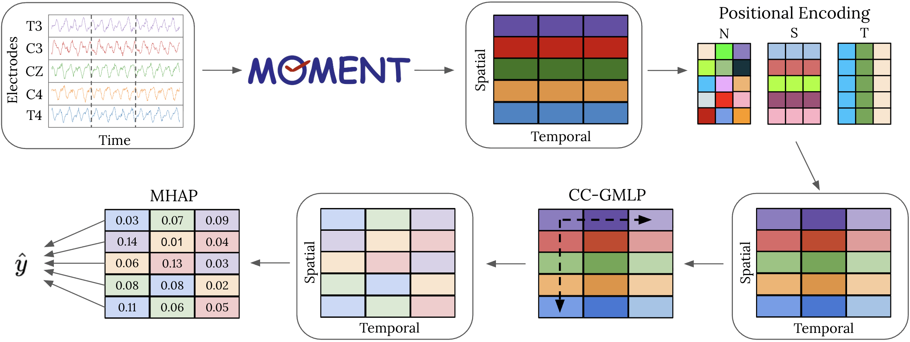
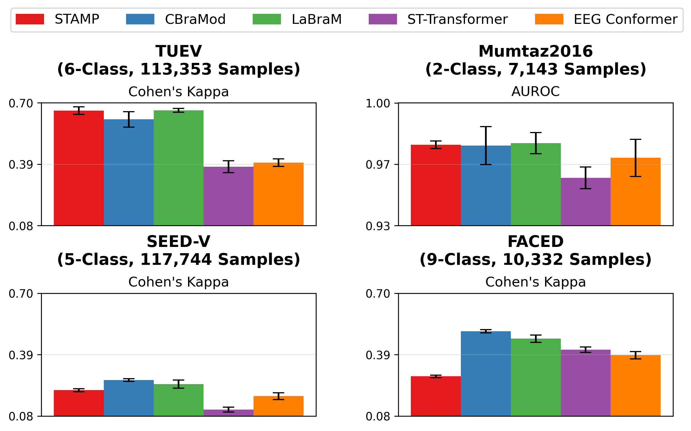
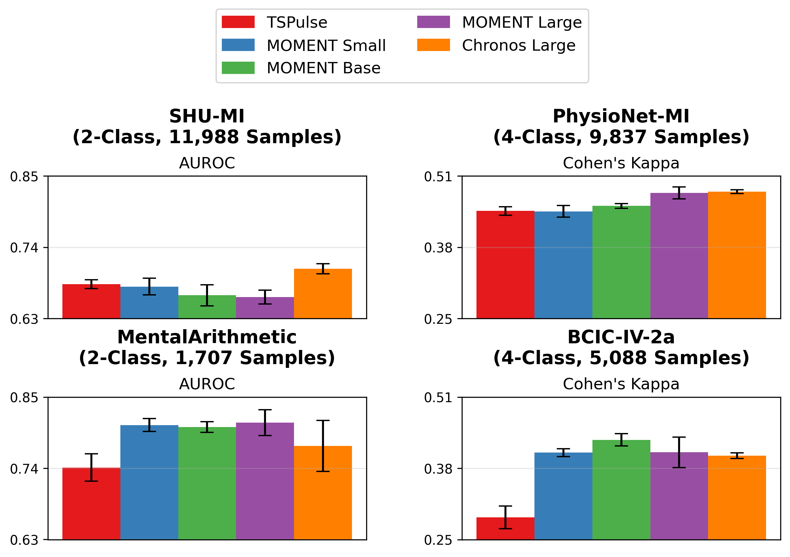
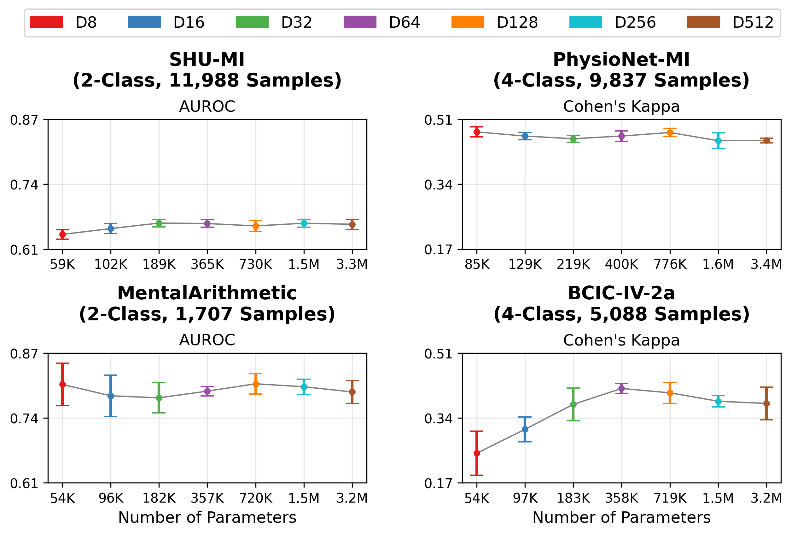

## STAMP: Spatial-Temporal Adapter with Multi-Head Pooling

**Official Implementation of _“STAMP: Spatial-Temporal Adapter with Multi-Head Pooling”_ (ML4H 2025, Proceedings of Machine Learning Research 297)**  
by [Brad Shook](mailto:bshook@andrew.cmu.edu), Abby Turner, Jieshi Chen, Michał Wiliński, Mononito Goswami, Jonathan Elmer, and Artur Dubrawski

---

## 🧩 Abstract

Time series foundation models (TSFMs) pretrained on data from multiple domains have shown strong performance on diverse modeling tasks. Various efforts have been made to develop foundation models specific to electroencephalography (EEG) data, which records brain electrical activity as time series. However, no comparative analysis of EEG-specific foundation models (EEGFMs) versus general TSFMs has been performed on EEG-specific tasks.

We introduce a novel **Spatial-Temporal Adapter with Multi-Head Pooling (STAMP)**, which leverages univariate embeddings produced by a general TSFM, implicitly models spatial-temporal characteristics of EEG data, and achieves performance comparable to state-of-the-art EEGFMs. A comprehensive analysis is performed on 8 benchmark datasets of clinical classification tasks using EEG. Our proposed adapter is lightweight in trainable parameters and flexible in the inputs it can accommodate, supporting easy modeling of EEG data using TSFMs.

---

## 🧠 Overview

<p align="center">
  
</p>

**STAMP** enables general-purpose TSFMs (such as **MOMENT**, **Chronos**, and **TSPulse**) to adapt effectively to EEG data without retraining or modifying the underlying foundation model.
By combining **positional encoding**, a **criss-cross gated MLP**, and **multi-head attention pooling**, STAMP captures inter-channel and temporal dependencies while maintaining high efficiency in the number of trainable parameters.

---

## 🧩 Method

Given EEG data with $S$ spatial channels and $T$ temporal channels, $\mathbf{X} \in \mathbb{R}^{S\times T \times K}$, we generate embeddings $\mathbf{E} \in \mathbb{R}^{T\times S \times \ell}$ from a pretrained TSFM. A learnable linear mapping projects $\mathbb{R}^\ell$ to $\mathbb{R}^D$ resulting in $E' \in \mathbb{R}^{S \times T \times D}$.

STAMP applies three lightweight modules:

$$
z = \text{MHAP}(\text{CC-GMLP}(\text{PE}(\mathbf{E'})))
$$

* PE($\cdot$) - Adds token, temporal, and spatial positional encodings to embed information about sequence structure.
* CC-GMLP($\cdot$) - A criss-cross gated MLP that models spatial and temporal channel relationships between tokens.
* MHAP($\cdot$) - A multi-head attention pooling mechanism that adaptively weights each token and outputs a representative vector $z \in R^D$

After MHAP, final predictions are generated via a linear projection followed by a softmax operation:

$$
\hat{y} = \mathrm{softmax}\left(W \cdot (\lambda z + (1 - \lambda)\hat{e})\right)
$$

where $W : \mathbb{R}^D \to \mathbb{R}^n$ maps the latent representation to $n$ output classes, 
$z$ is the pooled representation, and $\hat{e}$ is the mean-pooled representation of the output of the CC-GMLP.

For full details, please refer to our paper and the code implementations within `stamp/modeling/`.

---

## Initial Setup

To install STAMP, we recommend using `pip install -e .`. After installation, navigate to `stamp/local.py` and update the paths in the MyLocalConfig class - in particular, set the `datasets_dir` to point to the directory containing your EEG datasets.

## Data Preprocessing

The preprocessing code is adapted from [CBraMod](https://github.com/wjq-learning/CBraMod) (Wang et al. 2025). The scripts are located in `CBraMod/preprocessing`. Only minor optimizations (e.g., code parallelization) were made; therefore, the preprocessed outputs should be identical to those produced by the original CBraMod implementation.

To preprocess a dataset:

1. Locate the corresponding script in `CBraMod/preprocessing/`.
2. Modify the input and output paths within the script to point to your local dataset directories.
3. Run the script to generate preprocessed EEG data.

After preprocessing, update the corresponding entries in `processed_data_dirs` within `stamp/local.py`.

## Embedding Generation

Before generating embeddings, download pretrained weights for one or more time-series foundation models:
- [MOMENT](https://huggingface.co/AutonLab/MOMENT-1-large)
- [Chronos](https://huggingface.co/amazon/chronos-t5-large)
- [TSPulse](https://huggingface.co/ibm-granite/granite-timeseries-tspulse-r1)

Once downloaded, specify their local paths in `stamp/local.py`.

To generate embeddings, run:

```
python scripts/generate_embeddings.py
```

Before running, update the relevant parameters in the script as needed. Embedding generation can be parallelized across multiple GPUs by specifying GPU IDs in the available_gpus list.

---

## 🧪 Experiments

### 🔧 Creating Experiment Configurations

Experiments are defined through configuration files specifying datasets, model parameters, and hyperparameters.  
Configuration files can be generated using the script:

```bash
python scripts/create_stamp_experiment_grid.py
```

Within this script, you can define all hyperparameters to be used across datasets.
The script automatically creates configuration files for each dataset–hyperparameter combination, and assigns experiment names based on the configuration settings.

In addition to STAMP experiments, a separate script is provided for CBraMod:

```bash
python scripts/create_cbramod_experiment.py
```

The CBraMod results produced by this repository are consistent with those obtained from the [original CBraMod implementation](https://github.com/wjq-learning/CBraMod).

### 🚀 Running Experiments

To run STAMP experiments, use:

```bash
python scripts/run_embedding_exp_manual.py
```

This script supports running multiple experiments and datasets in a single execution.
Simply specify the experiment names and dataset names within the script configuration, and it will automatically execute all corresponding runs.

CBraMod experiments can be ran using the `scripts/run_cbramod_exp_manual.py` script. 

### Default STAMP Hyperparameters

General Hyperparameters
- Dropout Rate = 0.3
- Number of Epochs = 50
- D = 128
- Learning Rate Scheduler = OneCyle
- Initial Learning Rate = 5e-5
- Max Learning Rate = 0.0003
- Batch Size = 64
- Optimizer = AdamW
- Epsilon = 1e-8
- Weight decay = 0.05
- Normalization = Instance

CC-GMLP Hyperparameters
- Feedforward Dimension = 256
- Number of Blocks (L) = 8

MHAP Hyperparameters
- Number of Attention Heads = 4
- Number of Queries per Head = 8
- $\lambda$ for Residual = 0.1

The default hyperparameters are setup in `scripts/create_stamp_experiment_grid.py`.

## 📊 Results Summary

### STAMP vs. Baselines
---

<p align="center">
  
</p>

<p align="center">
  
</p>

STAMP achieves performance comparable or better than existing EEGFMs (CBraMod and LaBraM) on most datasets. Additionally, it generally outperforms the non-foundation model EEG baselines (ST-Transformer and EEG Conformer). 

### STAMP using Different TSFMs
---

<p align="center">
  
</p>

While the majority of our paper focuses on embeddings from MOMENT Large, we also evaluated STAMP using embeddings from MOMENT Small and Base, Chronos Large, and TSPulse. Notably, to our knowledge, Chronos and TSPulse were not pretrained on any EEG data (MOMENT was pretrained on a small number of EEG datasets). Our results demonstrate that STAMP can perform strongly with different TSFMs. 

### STAMP Size Comparison

<p align="center">
  
</p>

Our default STAMP architecture projects the initial embeddings to dimension $D = 128$. However, we found that STAMP can perform strongly at lower values of $D$ and greatly reduce the number of parameters. Contrarily, increasing $D$ does not improve performance.

---

## 🗂️ Repository Structure

```
STAMP/
├── stamp/
│   ├── analysis.py                     # Performance analysis and visualization
│   ├── embeddings.py                   # Embedding helper functions
│   ├── common.py                       # Shared helper functions
│   ├── experiments.py                  # Experiment setup, training, and evaluation
│   ├── local.py                        # Local path configurations
│   ├── datasets/
│   │   ├── lmdb_embedding_dataset.py   # Classes for embedding datasets
│   │   ├── lmdb_np_dataset.py          # Classes for numpy EEG datasets
│   │   ├── lmdb_pickle_dataset.py      # Classes for pickle EEG datasets
│   │   └── utils.py                    # Helper functions
│   ├── modeling/
│   │   ├── cbramod.py                  # Training and testing routines for CBraMod
│   │   ├── criss_cross_gated_mlp.py    # Criss-cross gated MLP component
│   │   ├── criss_cross_transformer.py  # Criss-cross transformer component
│   │   ├── early_stopping.py           # Early stopping module
│   │   ├── gated_mlp.py                # Gated MLP component
│   │   ├── mhap.py                     # Multi-Head Attention Pooling implementation
│   │   ├── modeling_approach.py        # Modeling approach abstraction
│   │   ├── moment_lora_adapter.py      # Training and testing routines for MOMENT LoRA + STAMP
│   │   ├── stamp_trainer.py            # Training and testing routines for STAMP
│   │   ├── stamp.py                    # Full STAMP architecture
│   │   └── utils.py                    # Modeling helper functions
│   └── scripts/
│       ├── create_cbramod_experiment.py            # Config generation for CBraMod
│       ├── create_stamp_experiment_grid.py         # Config generation for STAMP
│       ├── create_moment_lora_experiment_grid.py   # Config generation for MOMENT LoRA + STAMP
│       ├── generate_embeddings.py                  # TSFM embedding generation
│       ├── run_cbramod_exp_manual.py               # Runs CBraMod experiments
│       ├── run_embedding_exp_manual.py             # Runs STAMP and other embedding-based experiments
│       └── run_lora_exp_manual.py                  # Runs MOMENT LoRA + STAMP experiments
│
└── CBraMod/                            # EEG preprocessing (adapted from CBraMod, MIT License)
```

---

## 🧰 Requirements

Main packages:
* Python = 3.10.16
* PyTorch = 2.6.0
* NumPy, Pandas, Matplotlib, Seaborn
* scikit-learn, tqdm, lmdb
* h5py*, scipy*, mne*

*Some packages only pertain to preprocessing the original EEG data.


Optional packages:
* fvcore, peft

## 🔍 Interpretability

While our paper didn't investigate STAMP's interpretability, STAMP’s **MHAP** module yields spatial-temporal attention maps, revealing which EEG electrodes and temporal segments contribute most to predictions. These attention maps could be of interest for future work.

## 📚 Citation

If you use this work, please cite:

```
@inproceedings{shook2025stamp,
  title     = {STAMP: Spatial-Temporal Adapter with Multi-Head Pooling},
  author    = {Brad Shook and Abby Turner and Jieshi Chen and Michał Wiliński and Mononito Goswami and Jonathan Elmer and Artur Dubrawski},
  booktitle = {Proceedings of the <297\textsuperscript{th}> Machine Learning for Health (ML4H) Symposium}
  year      = {2025},
  publisher = {PMLR}
}
```

## 🪪 License

MIT License

Copyright (c) 2025 Auton Lab, Carnegie Mellon University

Permission is hereby granted, free of charge, to any person obtaining a copy of this software and associated documentation files (the "Software"), to deal in the Software without restriction, including without limitation the rights to use, copy, modify, merge, publish, distribute, sublicense, and/or sell copies of the Software, and to permit persons to whom the Software is furnished to do so, subject to the following conditions:

The above copyright notice and this permission notice shall be included in all copies or substantial portions of the Software.

THE SOFTWARE IS PROVIDED "AS IS", WITHOUT WARRANTY OF ANY KIND, EXPRESS OR IMPLIED, INCLUDING BUT NOT LIMITED TO THE WARRANTIES OF MERCHANTABILITY, FITNESS FOR A PARTICULAR PURPOSE AND NONINFRINGEMENT. IN NO EVENT SHALL THE AUTHORS OR COPYRIGHT HOLDERS BE LIABLE FOR ANY CLAIM, DAMAGES OR OTHER LIABILITY, WHETHER IN AN ACTION OF CONTRACT, TORT OR OTHERWISE, ARISING FROM, OUT OF OR IN CONNECTION WITH THE SOFTWARE OR THE USE OR OTHER DEALINGS IN THE SOFTWARE.

See [MIT LICENSE](LICENSE) for details.

Preprocessing code in `CBraMod/` is **adapted from [CBraMod](https://github.com/wjq-learning/CBraMod)** (MIT License).

## 📬 Contact

For correspondence or collaboration inquiries:
📧 **Brad Shook** — [bshook@andrew.cmu.edu](mailto:bshook@andrew.cmu.edu)
